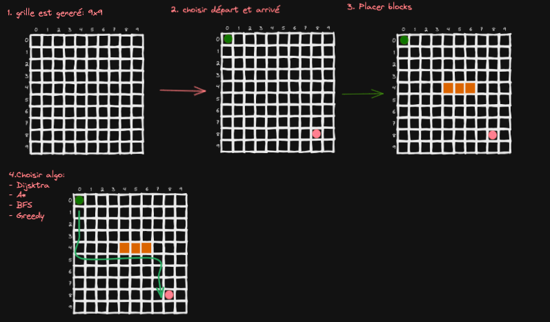

# Projet MD5
> **Status**: Not Started   
> **Next Deadline**: 21 Nov 2022

## Project Description

Le projet consiste à une application graphique. Dans cette application, une grille de taille `nxm` sera generée, et ensuite un point de départ et un point d'arrivé seront placé dans cette grille. 

L'utilisateur pourra placer (ou pas) des blocks qui vont bloquer une route dans la grille. Ensuite l'utilisateur doit choisir un algorithme de plus court chemin, lorsque l'algorithme à été choisit, l'interface graphique affichera le chemin optimal.

## Tasks Article
> Note: Respecter charte de bonne conduite.
- [ ] 1. Étudier la longueur et le nombre de chemin de longueur minimale dans une grille
(sans mur) de hauteur h et largeur l. - @danielgilardoni
- [ ] 2. Donner une borne maximale du nombre de chemin dans une grille. - @danielgilardoni @leopoldabgn
- [ ] 3. Décrire l’algorithme de parcours en largeur. - @leopoldabgn @parismollo
- [ ] 4. Écrire un programme qui prend en entrée un plan de ville (codé par l’objet de
votre choix, représentant une grille où certaines arêtes ont été enlevées) et renvoie
un des plus court chemin. - @leopoldabgn @danielgilardoni
- [ ] 5. Calculer la complexité de l’algorithme dans le pire des cas, sachant que l’on travaille
sur un des sortes de graphes particuliers (issus d’une grille). Comparer avec une
méthode naïve qui ferait la liste des chemins de la grille avant d’enlever ceux bloqués
par des murs puis de prendre l’un des chemins restant de longueur minimale - @parismollo @danielgilardoni

## Tasks Annexe
- [ ] Voir description projet :
  - [ ] 1. Map representation - @parismollo
  - [ ] 2. Algorithms :
    - [ ] Greedy - @danielgilardoni
    - [ ] A* - @parismollo
    - [ ] Dijkstra - @leopoldabgn
    - [ ] Autre algos ? - @danielgilardoni
  - [ ] 3. Project Architecture - @ALL
  - [ ] 4. Interface Graphique - @leopoldabgn @parismollo
  - [ ] 5. Animations - @leopoldabgn @parismollo

- [ ] 6. Calculer la complexité de l’algorithme dans le pire des cas, sachant que l’on travaille
sur un des sortes de graphes particuliers (issus d’une grille). Comparer avec une
méthode naïve qui ferait la liste des chemins de la grille avant d’enlever ceux bloqués
par des murs puis de prendre l’un des chemins restant de longueur minimale - @danielgilardoni

## References
* [Introduction to Path Finder algorithms](https://www.redblobgames.com/pathfinding/a-star/introduction.html)

## Authors
@parismollo 
@danielgilardoni 
@leopoldabgn 
